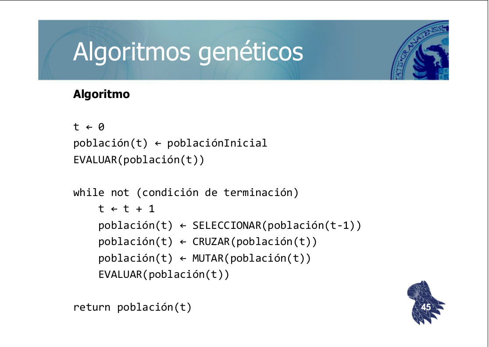

# Diario del trabajo
En este documento se irá recogiendo el avance del trabajo por días, con las observaciones y conclusiones que se vayan realizando. La finalidad de esto es facilitar la redacción de una memoria al finalizar el trabajo.


## 13/12/2016
Nos acaban de explicar la práctica, aqúi recojo los comentarios que he apuntado:

- Hay que implementar las 3 variables: estandar, variable lamarkiana y variable balwiniana:
  - Las 2 ultimas utilizan optimización local en cada cromosoma y utiliza como valor de fitness el optimizado.


- El problema del QAP es una generalización del viajante de comercio.


- La idea de la variantes lamarkianas y baldwinianas es que podemos utilizar un algoritmo de optimización local (greddy eficiente) para mejorar la solución que representa ese cromosoma
  - Lamarkiana => se hereda lo aprendido => los cromosomas heredados son los optimizados.
  - Baldwin => el cromosoma sigue siendo el original, no se heredan los rasgos optimizados pero es mas probable que hereden.


- En la pagina de la base de datos están las soluciones óptimas conocidas, lo suyo es acercarse a eso.


- Modelo elitista para mecanismo de remplazo de generación: los mejores individuos pasan a la siguiente generación directamente, no son eliminados al cambiar.


- Operador de mutuación: si solución es vector int no basta con modificar 1 valor, lo mas habitual es intercambiar 2 valores al azar del vector.


- Operador de cruce: distintos tipos


- Mecanismo de seleción de individuos a reproducir


- Una permutación es valida si no se repiten los números (es un vector de ints)


- Función de coste dependiente 2 matrices, distancias y flujos


- Echarle un vistazo a las [diapositivas de la asignatura sobre computación evolutiva (G1 y G2)](http://elvex.ugr.es/decsai/computational-intelligence/):

```
Evolución	 <=>	Resolución de problemas
Entorno       <=>	 Problema
Individuo 	<=>	Solución candidata
Adaptación    <=>	Calidad de la solución
 (fitness)
```

#### Caraterísticas esenciales de un algoritmo genético
- Inicialización (generación aleatoria de una población inicial)
- Variación (operadores de cruce y mutación)
- Evaluación (aptitud [fitness] de cada individuo)
- Selección (selección probabilística)

#### Pseudocódigo de un algoritmo genético clásico



## 17/01/2017
He creado un proyecto en eclipse con una clase `Data` que contiene la funcionalidad necesaria para cargar los distintos ficheros de datos que se encuentran en la carpeta `qap.data`.

Para comenzar con la implementación se puede ver [http://www.theprojectspot.com/tutorial-post/creating-a-genetic-algorithm-for-beginners/3](http://www.theprojectspot.com/tutorial-post/creating-a-genetic-algorithm-for-beginners/3) que parece un tutorial básico e interesante para crear una versión inicial del algoritmo.

#### Campos a rellenar del formulario de entrega de resultados
- Algoritmo empleado (estandar, variante baldwiniana, variante lamarckiana...)
- Tamaño población
- Número generaciones
- Mecanismo de selección (de padres)
  - Selección proporcional - Ruleta
  - Selección proporcional - SUS [Stochastic Universal Sampling]
  - Selección proporcional con "windowing"
  - Selección proporcional con "sigma scaling"
  - Ranking lineal
  - Ranking exponencial
  - Selección por torneo
  - otro
- Mecanismo de remplazo (selección de supervivientes)
  - Modelo generacional (Standard GA)
  - Modelo estacionario (Steady-state GA)
  - Modelo elitista
  - otro
- Operador de cruce
- Operador de mutación
- Optimización local
- Coste de la solución => Valor de función fitness
- Solución encontrada

Me pondré a leer la presentación G2 de los apuntes de la asignatura para entender que significa cada una de estas cosas y esta tarde en clase empezaré más con la implementación.

#### Preguntas iniciales
- [x] **¿Cuál sería el genotipo de este problema, que representaría?** El genotipo es el orden en el que se multiplican las columnas de una de las matrices (la de distancia por ejemplo)
- [x] **¿Cuál será la función de fitness?** El valor de la función de optimización en negativo.
- [x] **¿Qué es la permutación p() sobre el conjunto de instalaciones?** Es un vector de enteros del tamaño del problema concreto en los que no se puede repetir ningún elemento.  
- [x] **¿Cual será el operador de cruce?** Cruce ordenado
- [ ] **¿Cuál será el mecanismo de selección?**
- [ ] **¿Cuál será el operador de mutación?**

#### Comentarios de clase
Hay que minimzar la sumatoria de A[i][j] * B [P(i)][P(j)]

Para el operador de cruce hay que elegir por donde cortar, una vez elegido eso se combina pero probando que al introducir un número no esté ya, si ya está se seleccionaría el siguiente. Ej.
```
12|34 => 12|43
31|24 => 31|42
```

## 19/01/2017

Leyendo el libro de [*Genetic Algorithms in Java Basics*](http://www.apress.com/9781484203293)  by Lee Jacobson and Burak Kanber (Apress, 2015), en él resuelven el problema del viajante, que tiene características similares al QAP, por ello he decidido leer como lo solucionan para aplicar medidas similares.

- He visto que seria interesante como operador de cruce el crossover ordenado.
- Como condición de terminación usare un número máximo de generaciones sin mejorar el fitness medio de la población. Habrá que mirar como funciona porque igual es mejor hacerlo sobre el fitness del mejor individuo ya que el fitness medio se puede incrementar lentamente y no terminar casi nunca aunque se atasque.

## 20/01/2017
He implementado el operador de cruce comentado arriba, pero la versión del crossover ordenado empleado en el mencionado libro  parece peculiar, respeta el orden pero para rellenar con el otro padre tras transmitir el fragmento del primer padre continúa desde la posición de corte hasta el final del segundo padre, en lugar de recorrer el segundo padre linealmente, sería **interesante probar la diferencia**. me falta seleccionar un operador de mutación y un mecanismo de selección.

Viendo los apuntes de la asignatura sobre la selección dice que está demostrado que no se puede alcanzar solución óptima sin usar selección elitista, es decir, que los n mejores miembros de una población pasen a la siguiente directamente. En muchos casos el valor de esa n es 1 pero sería interesante que fuera 2 para intentar evitar atascarse en 1 mínimo local cuando la población tenga poca variabilidad, en caso de seleccionar los 2 mejores individuos estos, con algo de suerte, pueden pertenece a 2 máximos locales distintos con lo que hay mas posibilidad de escapar cuando se combinen.

Respecto al mecanismo de selección concreto a utilizar según los apuntes, estos se dividen en 3 grandes grupos:
- Mecanismos de selección proporcional (ruleta, SUS,...): Asigna probabilidades de selección en función del valor fitness de cada individuo y selecciona aleatoriamente individuos con esas probabilidades.
- Mecanismos basados en Ranking: Intentan eliminar los problemas de los previos asignando probabilidades teniendo en cuenta los valores relativos de fitness. Conllevan cálculos más complejos.
- Selección por torneo: selecciona aleatoriamente k miembros de la población y escoge el mejor repitiendo esto las veces necesarias.

De estos métodos los que más he visto han sido la selección proporcional por ruleta y el mecanismo de torneo, teniendo en cuenta el gran número de operaciones a llevar a cabo descartaría los mecanismos de ranking porque seguramente ralentizarían todo el proceso. Teniendo en cuenta comentarios de clase el verdadero poder de los algoritmos genéticos es la aleatoriedad, por ello confiare totalmente en ella implementando una selección por torneo. El tamaño típico de torneo es de 5 individuos así que provaré con ese.

Como mecanismo de mutación teniendo en cuenta las características concretas del problema he seleccionado la mutacion por intercambio (swap), aleatoriamente se selecciona un gen con una probabilidad de **0.02%**

Estoy pensando en paralelizar el algoritmo aprovechando multiples hilos. Así de primeras se me ocurre que se podría dividir la población a cruzar tras guardar a los elite y que cada hilo se encargara de una parte de la población, habría que estudiarlo que no diera problemas, igual es necesario convertir la clase Algorithm en no estática para que cada hilo tenga su copia.

## 21/01/2017
Voy a cambiar la función de fitness para obtener valores positivos, bastará con cambiar el cálculo del fitness, la obtención de los individuos con más fitness y la condición de terminación.

He cambiado el método para extraer el fitness de la población usando `SortedSet` en lugar de reordenar el array usando `Array.sort()`, con el array se podian llegar a salvar 2 copias del mismo individuo como elite de la población, al utilizar un SortedSet se eliminan los duplicados (igual fitness e iguales genes) con lo que te aseguras que siempre sean individuos distintos. Además no parece tener efecto en el rendimiento con el problema tai256c y 100 generaciones.

Probando a cambiar la probabilidad de mutación parece que se alcanzan mejores resultados al bajar dicha tasa obteniendo el mejor resultado hasta ahora con una frecuencia de mutación de gen de 0.002 (en tanto por 1).

Voy a intentar optimizar usando un algorítmo greedy para obtener las variables lamarkiana y balwiniana de este algoritmo. Para ello he implementado el algoritmo greedy 2-opt que aparece en el enunciado de la práctica y lo he probado en la generación de una población, lo que constituye una estrategia constructiva. El problema son los tiempos de ejecución, son muy elevados, superiores a 2 minutos para la generación de una población de 10 individuos. Por ello he decidido paralelizar la generación de una población con optimización greedy usando 4 o 2 hilos en función de la capacidad del ordenador donde se ejecute. He logrado reducir los tiempos con 4 hilos a 1 minuto y con 2  sobre unos 80 segundos.

Probándolo con un tamaño de población más normal, de 100 individuos, he logrado que el algoritmo se ejecute en 8 minutos y 15 segundos. Aún así habría que optimizar más, siguiendo los comentarios del profesor se puede optimizar el proceso de cálculo de fitness durante el proceso de optimización local usando el fitness actual y los cambios realizados en lugar de recalcular entero, tendré que estudiarlo para mañana. En cualquier caso parece prometedora la optimización, solo aplicada a la generación de una población se obtienen resultados con fitness del orden de 44.900.000 mientras que el mejor resultado obtenido previamente era de 46.131.559

Cuando logre optimizar ese proceso tendré que crear una ejecución del algoritmo teniendo en cuenta el tipo de optimización así como la aplicación del óptimo local en función de la variante concreta del algoritmo. Tras esto solo quedaría jugar con los paramétros y ver como se obtienen los mejores resultados.
